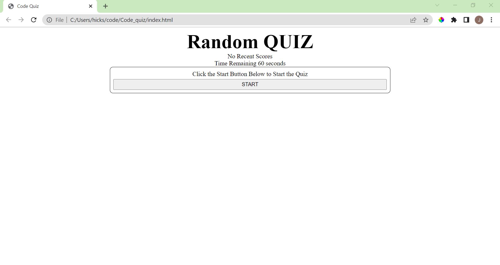
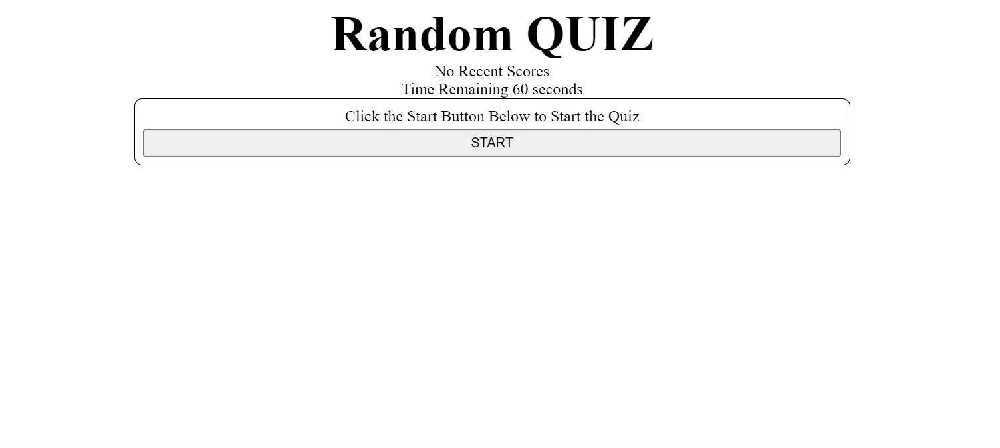

# Code_Quiz

## Project description
Code Quiz is a quirky quiz game. Answer the questions prompted on the screen and record your results. 

## Installation Instructions
No installation required 
        
## How To Use
Open the index.html and select the start button to start your game. If no recent players have scored in the game (or your local storage is emptied) there will be no recorded scores. After the timer has started you will have 60 seconds to answer the questions. If you answer incorrectly you will lose 10 seconds on the timer. Upon completing the quiz OR when the timer hits 0 you will be prompted to enter your initals to keep log of your score.

This is a photo of the prompts in the terminal:

See Gif example:

        
## Contributing 
Application uses JavaScript, HTML, and CSS. All coding done by Jeff Hicks